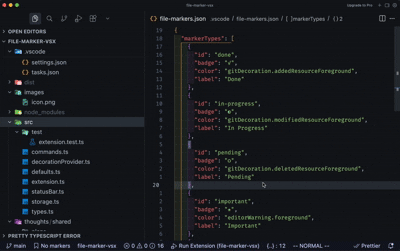

# File Markers

Track file and folder status directly in VSCode's Explorer. Right-click to add visual markers like Done, In Progress, or Pending—no config files to edit, no separate sidebar to manage.

Perfect for migrations, refactoring projects, and code reviews.

<!--  -->

## Features

- **Right-click to mark** — Set markers directly from the Explorer context menu
- **Visual badges** — See file status at a glance with colored badges
- **Folder support** — Mark entire folders, not just files
- **Persistent markers** — Markers survive restarts and can be shared with your team
- **Zero configuration** — Works out of the box

## Available Markers

| Marker | Badge | Use Case |
|--------|-------|----------|
| Done | ✓ | Completed files |
| In Progress | ◐ | Currently working on |
| Pending | ○ | Not started yet |
| Important | ★ | High priority files |
| Needs Review | ◉ | Ready for code review |
| Question | ? | Need clarification |

## Usage

1. Right-click any file or folder in the Explorer
2. Select **File Markers** from the context menu
3. Choose a marker type (or **Remove Marker** to clear)

<!--  -->

## Storage

Markers are stored in `.vscode/file-markers.json` in your workspace. Commit this file to share markers with your team, or add it to `.gitignore` for personal use.

```json
{
  "version": 1,
  "markers": {
    "src/old-api.ts": "done",
    "src/utils": "in-progress"
  }
}
```

## Use Cases

- **Migrations** — Track which files have been migrated to a new framework
- **Refactoring** — Mark files as you work through a large refactor
- **Code Reviews** — Flag files that need attention
- **Onboarding** — Mark files you've reviewed while learning a codebase
- **Tech Debt** — Highlight files that need improvement

## Requirements

- VSCode 1.74.0 or higher

## Known Issues

None yet. [Report an issue](https://github.com/joneldominic/vscode-file-markers/issues)

## Release Notes

### 0.0.1

Initial release

---

## License

[MIT](LICENSE)
