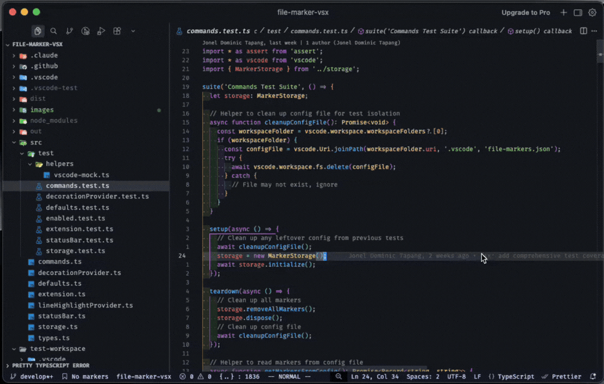
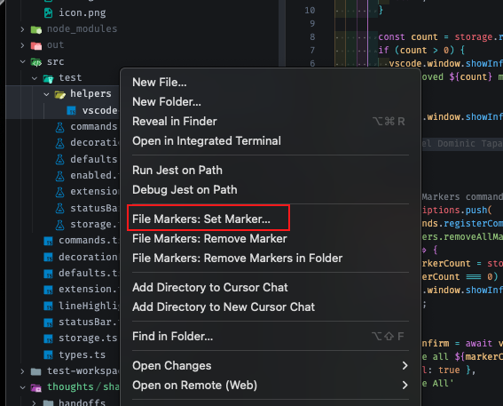
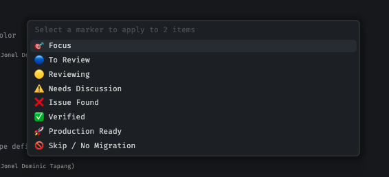
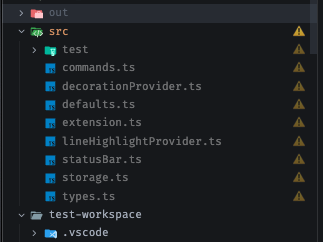
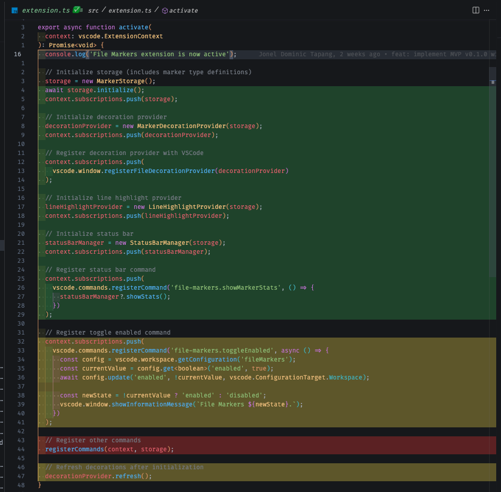
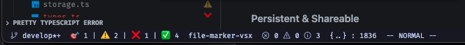
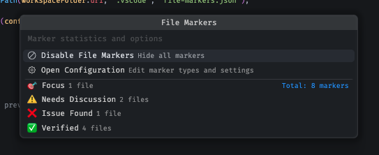

# File Markers

[](https://github.com/joneldominic/vscode-file-markers/blob/main/LICENSE)
[](https://github.com/joneldominic/vscode-file-markers/actions/workflows/ci.yml)

**VS Code Marketplace:**
[](https://marketplace.visualstudio.com/items?itemName=joneldominic-dev.file-markers)
[](https://marketplace.visualstudio.com/items?itemName=joneldominic-dev.file-markers)
[](https://marketplace.visualstudio.com/items?itemName=joneldominic-dev.file-markers)

**Open VSX:**
[](https://open-vsx.org/extension/joneldominic-dev/file-markers)
[](https://open-vsx.org/extension/joneldominic-dev/file-markers)
[](https://open-vsx.org/extension/joneldominic-dev/file-markers)

Track file and folder status directly in VSCode's Explorer. Right-click to add visual markers like Done, In Progress, or Pending—no config files to edit, no separate sidebar to manage.

**Perfect for migrations, refactoring projects, and code reviews.**



## Features

### Right-Click to Mark

Add markers to any file or folder directly from the Explorer context menu.





### Visual Badges

See file status at a glance with colored badges in the Explorer panel.

| Marker       | Badge | Color  | Use Case              |
| ------------ | ----- | ------ | --------------------- |
| Done         | ✓     | Green  | Completed files       |
| In Progress  | ◐     | Yellow | Currently working on  |
| Pending      | ○     | Red    | Not started yet       |
| Important    | ★     | Orange | High priority files   |
| Needs Review | ◉     | Blue   | Ready for code review |
| Question     | ?     | Purple | Need clarification    |

> **Note:** Badges are limited to **2 characters** maximum ([VSCode FileDecoration API limitation](https://code.visualstudio.com/api/references/vscode-api#FileDecoration)).

### Folder Markers with Inheritance

Mark entire folders! With inheritance enabled, unmarked files inside a marked folder automatically display a dimmed version of the parent's marker.



### Keyboard Shortcuts

Quickly toggle markers and highlights:

- **Toggle file marker**: `Ctrl+Shift+M` (`Cmd+Shift+M` on macOS)
- **Toggle line highlight**: `Ctrl+Shift+H` (`Cmd+Shift+H` on macOS)

### Line Highlighting

Highlight specific lines or ranges in your editor with color-coded backgrounds. Right-click selected text or use the keyboard shortcut to apply highlights.



| Highlight        | Color  | Use Case                |
| ---------------- | ------ | ----------------------- |
| Yellow Highlight | Yellow | General emphasis        |
| Green Highlight  | Green  | Approved/good code      |
| Blue Highlight   | Blue   | Reference/informational |
| Red Highlight    | Red    | Issues/problems         |
| Purple Highlight | Purple | Notes/special attention |

- **Set highlight**: Select lines → right-click → **File Markers: Set Line Highlight...**
- **Toggle highlight**: Press `Ctrl+Shift+H` (`Cmd+Shift+H` on macOS) to cycle through highlight colors on the current line
- **Remove highlight**: Select the highlighted lines → right-click → **File Markers: Remove Line Highlight**

Files with line highlights display a `≡` badge in the Explorer panel.

### Status Bar Summary

See marker counts at a glance in the status bar. Click to view detailed statistics, toggle the extension, or open configuration.





### Bulk Operations

- Multi-select files and apply markers to all at once
- Remove all markers in a folder
- Remove all markers in workspace via Command Palette

### Persistent & Shareable

Markers are stored in `.vscode/file-markers.json`. Commit this file to share markers with your team, or add it to `.gitignore` for personal use.

### Custom Marker Types

You can define custom marker types by editing `.vscode/file-markers.json` directly. The file supports both marker assignments and custom marker type definitions:

```json
{
  "markerTypes": [
    {
      "id": "done",
      "badge": "✅",
      "color": "gitDecoration.addedResourceForeground",
      "label": "Done"
    },
    {
      "id": "blocked",
      "badge": "🚫",
      "color": "errorForeground",
      "label": "Blocked"
    },
    {
      "id": "needs-discussion",
      "badge": "⚠️",
      "color": "editorWarning.foreground",
      "label": "Needs Discussion"
    }
  ],
  "markers": {
    "src/old-api.ts": "done",
    "src/utils": "blocked"
  },
  "lineHighlightTypes": [
    {
      "id": "highlight-yellow",
      "color": "rgba(255, 235, 59, 0.3)",
      "label": "Yellow Highlight"
    }
  ],
  "lineHighlights": {
    "src/old-api.ts": [
      { "startLine": 10, "endLine": 15, "typeId": "highlight-yellow" }
    ]
  }
}
```

**Marker Type Properties:**

| Property | Required | Description                                                                              |
| -------- | -------- | ---------------------------------------------------------------------------------------- |
| `id`     | Yes      | Unique identifier used in the `markers` object                                           |
| `badge`  | Yes      | 1-2 character badge displayed in Explorer (emoji or text)                                |
| `color`  | Yes      | VSCode theme color ID (e.g., `errorForeground`, `gitDecoration.addedResourceForeground`) |
| `label`  | Yes      | Display name shown in QuickPick and tooltips                                             |

**Line Highlight Type Properties:**

| Property | Required | Description                                                  |
| -------- | -------- | ------------------------------------------------------------ |
| `id`     | Yes      | Unique identifier used in the `lineHighlights` object        |
| `color`  | Yes      | CSS color value with alpha (e.g., `rgba(255, 235, 59, 0.3)`) |
| `label`  | Yes      | Display name shown in QuickPick                              |

> **Tip:** Use `File Markers: Open Configuration` command to quickly open the config file. Changes are detected automatically—no need to reload VSCode.

## Installation

1. Open VSCode
2. Go to Extensions (`Ctrl+Shift+X` / `Cmd+Shift+X`)
3. Search for **"File Markers"**
4. Click **Install**

Or install via command line:

```bash
code --install-extension joneldominic-dev.file-markers
```

## Usage

### Setting a Marker

1. Right-click any file or folder in the Explorer
2. Select **File Markers: Set Marker...**
3. Choose a marker type from the QuickPick menu

### Removing a Marker

- Right-click a marked item → **File Markers: Remove Marker**
- Or use the Command Palette → **File Markers: Remove All Markers**

### Keyboard Toggle

Press `Ctrl+Shift+M` (Windows/Linux) or `Cmd+Shift+M` (macOS) to cycle through markers on the active file.

### Highlighting Lines

1. Select one or more lines in the editor
2. Right-click → **File Markers: Set Line Highlight...**
3. Choose a highlight color from the QuickPick menu

To remove: select the highlighted lines → right-click → **File Markers: Remove Line Highlight**

### Viewing Statistics

Click the marker summary in the status bar to see a breakdown of all markers in your workspace.

## Extension Settings

| Setting                            | Default  | Description                                                                                         |
| ---------------------------------- | -------- | --------------------------------------------------------------------------------------------------- |
| `fileMarkers.enabled`              | `true`   | Enable or disable File Markers. When disabled, markers are hidden but preserved                     |
| `fileMarkers.inheritFolderMarkers` | `false`  | When enabled, unmarked files inside a marked folder display a dimmed version of the folder's marker |
| `fileMarkers.statusBarAlignment`   | `"left"` | Position of marker statistics in the status bar (`"left"` or `"right"`)                             |

## Use Cases

- **Migrations** — Track which files have been migrated to a new framework
- **Refactoring** — Mark files as you work through a large refactor
- **Code Reviews** — Flag files that need attention
- **Onboarding** — Mark files you've reviewed while learning a codebase
- **Tech Debt** — Highlight files that need improvement
- **Task Tracking** — Visual progress on file-by-file tasks

## Commands

| Command                                            | Description                                        |
| -------------------------------------------------- | -------------------------------------------------- |
| `File Markers: Set Marker...`                      | Add or change a marker on selected files           |
| `File Markers: Remove Marker`                      | Remove marker from selected files                  |
| `File Markers: Remove Markers in Folder`           | Remove all markers from files in a folder          |
| `File Markers: Remove All Markers`                 | Remove all markers in the workspace                |
| `File Markers: Toggle Marker`                      | Cycle through markers on the active file           |
| `File Markers: Toggle Enable/Disable`              | Enable or disable the extension                    |
| `File Markers: Set Line Highlight...`              | Add a color highlight to selected lines            |
| `File Markers: Remove Line Highlight`              | Remove highlight from selected lines               |
| `File Markers: Remove All Line Highlights in File` | Remove all highlights in the current file          |
| `File Markers: Toggle Line Highlight`              | Cycle through highlight colors on the current line |
| `File Markers: Remove All Line Highlights`         | Remove all line highlights in the workspace        |
| `File Markers: Show Marker Statistics`             | View marker counts by type                         |
| `File Markers: Open Configuration`                 | Open extension settings                            |

## Requirements

- VSCode 1.74.0 or higher

## Known Issues

None yet! [Report an issue](https://github.com/joneldominic/vscode-file-markers/issues)

## Contributing

Contributions are welcome! Please open an issue or submit a pull request on [GitHub](https://github.com/joneldominic/vscode-file-markers).

## Release Notes

See [CHANGELOG.md](CHANGELOG.md) for detailed release history.

---

## License

[MIT](LICENSE)
